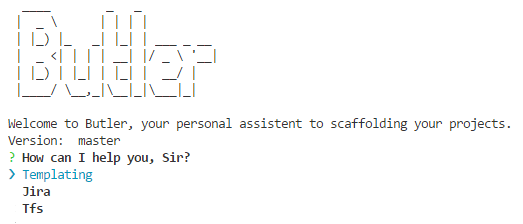

# butler
Welcome to Butler, your personal assistent to scaffolding your projects.
Shipped with binaries for Mac, Win and Linux (64-bit).

# Usage

[Download here](releases)

```sh
$ butler
```



# Commands

## Templating

Clone a git project template and substituted placeholders. All available templates are managed in the `butler.yml` file. Butler is shipped with a default config. If you want to create a project template look [here](https://golang.org/pkg/text/template/) to get an overview about the template language. We use a different delimiter to avoid collsion with existing.

### Delimiter

```
butler{ .Project.Name }
```

### Available variables:

- Project.Name: Project name
- Project.Description: Project description
- Date: Current Date (RFC3339)
- Year: Current year

# Development

## Installation
```
$ go get ./..
```

## Build Binaries

```
$ go get github.com/goreleaser/goreleaser
$ goreleaser
```

## Publish

```
$ git tag -a v0.1.0 -m "First release"
$ git push origin v0.1.0
```
